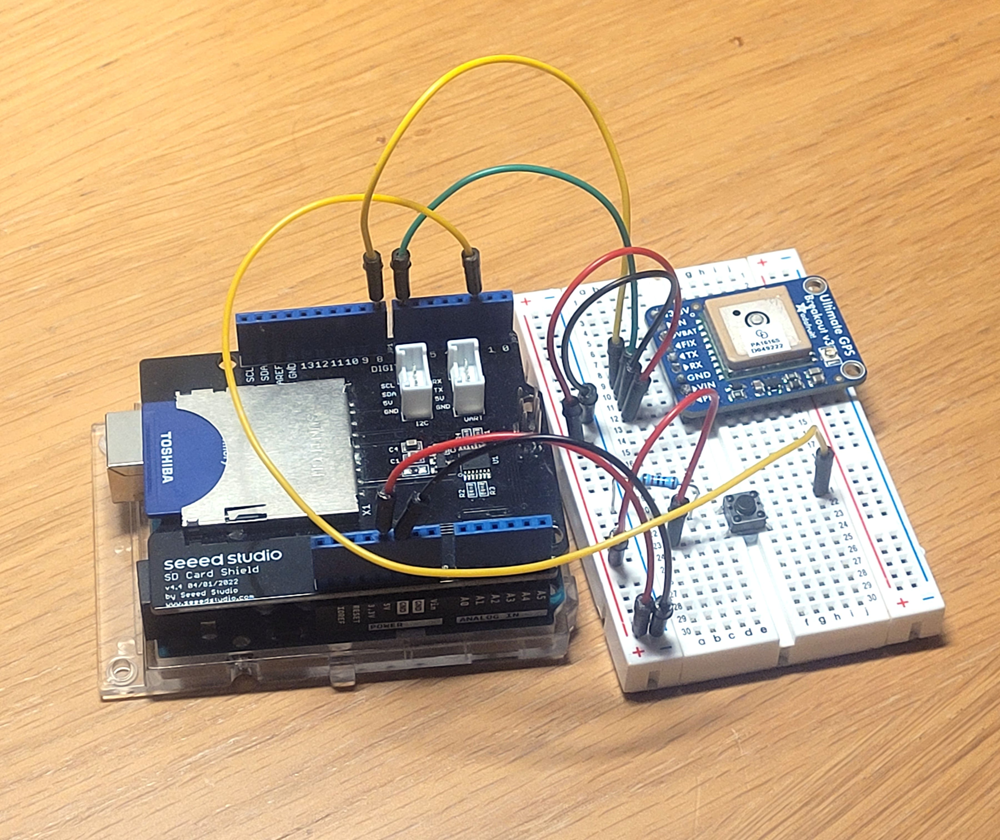

# Hiking-Datalogger
A compact, standalone hike tracker built with an Arduino, GPS module, and SD card. It captures real-time position data to monitor route distance and hiking metrics.

The aim of this project will be to integrate an Arduino with an SD card, GPS module and battery to create a device that will track different metrics on a hike.

Bill of Materials:
- Arduino Uno
- SD Card Shield (seeed studio v4.4)
- GPS (adafruit Ultimate GPS Breakout v3)
- Button
- Wires

What the system currently looks like:

