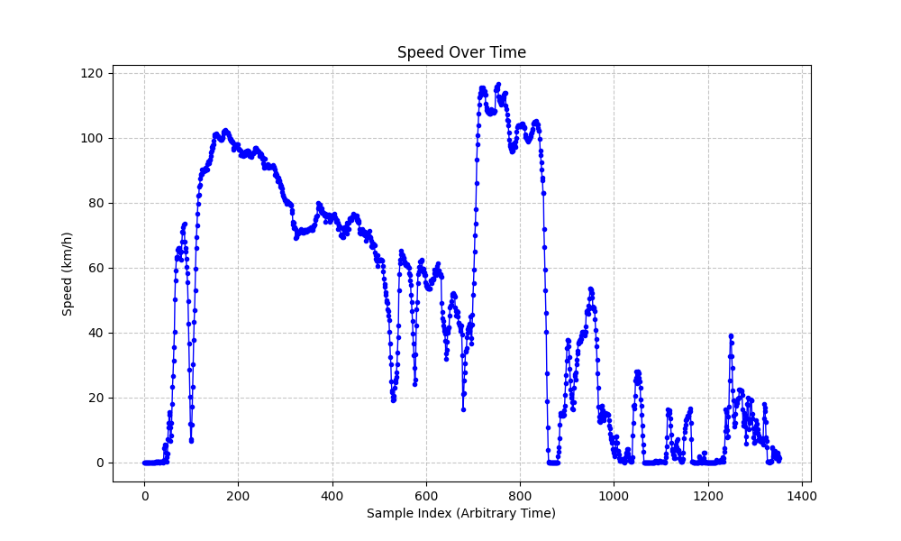

# Hiking-Datalogger
A compact, standalone hike tracker built with an Arduino, GPS module, and SD card. It captures real-time position data to monitor route distance and hiking metrics.

The aim of this project will be to integrate an Arduino with an SD card, GPS module and battery to create a device that will track different metrics on a hike.

### Bill of Materials:
- Arduino Uno
- SD Card Shield (seeed studio v4.4)
- GPS (adafruit Ultimate GPS Breakout v3)
- Button
- Wires

### What the system currently looks like:


### Speed and Time Graph:
As part of proof of concept testing the system is taken on a car journey across city and motorway roads. This is done to create an initial dataset as the system is not yet waterproof and might not survive a hike in the Irish weather. Below is a plot of speed from the journey:


### Elapsed Time Output:
Extracting information from the GPRMC sentences gives access to the time and date the data was taken. The following is example output:
```
Start time   | 2025-12-27 15:19:18+00:00
End time     | 2025-12-27 15:41:18+00:00
Journey time | 0:22:00
```